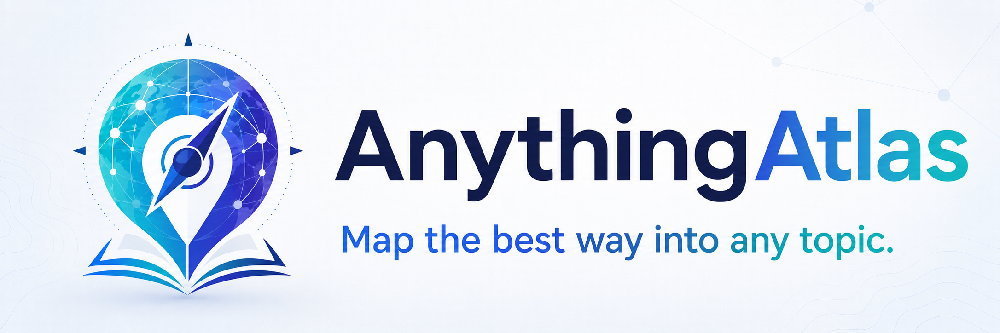

<p align="center">
  
</p>

<h1 align="center">AnythingAtlas</h1>

<p align="center"><strong>Map the best way into any topic</strong></p>

<p align="center"><strong>规划学习任何主题的最佳路径</strong></p>

<p align="center">
  <a href="https://agentskills.io/"></a>
  <a href="https://learn.chatgpt.com/docs/build-skills"></a>
  <a href="https://code.claude.com/docs/en/skills"></a>
  
  <a href="LICENSE"></a>
</p>

<p align="center">
  English · <a href="README.zh-CN.md">简体中文</a>
</p>

## 🧭 What is AnythingAtlas?

AnythingAtlas is an Agent Skill built for the first step into unfamiliar territory. You can use it with Claude Code, Codex, and other Agent Skills-compatible frameworks.

When you begin learning a new field or confronting an unfamiliar subject, the hardest part is often not finding information. It is working out what truly matters, which resources are worth your time, and where to begin.

Whether you want to enter quantitative finance, research AI agents, understand a historical event, or master a practical skill, AnythingAtlas turns scattered books, courses, papers, experts, archives, repositories, and online noise into a clear map of the field: its foundations, the resources worth learning from, how to use them, and a step-by-step plan that takes you from beginner to advanced.

**All you need to do is tell AnythingAtlas what you want to learn and how much time you have. It will guide you through a focused set of questions, search broadly for carefully selected learning resources, and build a personalized study plan around your needs.**

## ✨ Features

- **Proactive clarification:** AnythingAtlas asks only about details that change the result, including the goal, starting point, urgency, normal session length, preferred format, language, access, and desired depth.
- **Answer first:** It leads with a direct conclusion, concrete recommendations, and decisive trade-offs instead of making the user read through generic background.
- **Practical field guide:** It maps the actual tools, platforms, products, people, institutions, methods, works, or representative players the user will encounter.
- **Topic-aware discovery:** It distinguishes between knowledge domains, academic questions, new skills, events, and other topic types, then applies a suitable discovery strategy and chooses sources accordingly.
- **Broad research:** It searches the information channels that fit the topic, including academic indexes, archives, official documentation, code repositories, professional institutions, expert accounts, and practitioner communities.
- **Information verification:** It checks the authority and reliability of resources and information.
- **Resource fit:** It builds short-session, balanced, or deep resource tracks that specify who each route suits and exactly what to consume.
- **Action kit:** For practical requests, it names the setup and gives a first-session workflow, decision rules, and relevant safety or quality checks.
- **Learning design:** It builds a roadmap with explicit resource assignments, tasks, time estimates, milestones, stage deliverables, and completion criteria.
- **Easy reading:** It produces synchronized Markdown alongside responsive, accessible, print-friendly HTML.

## 🗺️ How it works

```text
Initial request: the topic and the time available
   ↓
Focused clarification and confirmed brief: guided questions to understand the learner and their needs
   ↓
Direct orientation and field guide: answer the real question and map concrete options
   ↓
Practical action kit: setup, first-session workflow, and decision rules
   ↓
Topic classification, discovery, verification, ranking, and curation
   ↓
User-fit resource tracks and a detailed personalized roadmap
   ↓
Source and information-channel appendix: show how information quality was verified
   ↓
Output: Markdown file + polished, self-contained HTML file
```

AnythingAtlas changes its resource selection, information channels, and verification priorities to match the type of topic:

| Topic type | Priority resources | Main information channels | Core evaluation criteria |
| --- | --- | --- | --- |
| Mature academic field | Textbooks, review papers, university courses, professional standards | Library catalogs, academic indexes, university course pages, professional societies | Canonical status, academic consensus, systematic coverage |
| Fast-moving technology | Recent papers, technical reports, source code, benchmarks | Preprint servers, conference proceedings, official repositories, research labs, expert briefings | Recency, reproducibility, maintenance activity |
| Historical event | Primary documents, archives, oral histories, scholarly monographs | National and local archives, library collections, museums, academic databases | Provenance, historical context, separation of fact from interpretation |
| Person or organization | Interviews, speeches, institutional records, biographies, credible reporting | Official websites, institutional archives, interview collections, news databases | First-party records and external verification, chronology, conflicts of interest |
| Industry research | Official statistics, regulatory filings, corporate disclosures, research reports | Regulatory databases, statistics portals, company filings, industry associations, professional publications | Data definitions, conflicts of interest, timeliness |
| Practical skill | Official documentation, demonstrations, structured courses, practice projects | Official documentation sites, course platforms, project repositories, practitioner communities | Practicality, progression of difficulty, quality of practice and feedback |
| Social issue | Official data, systematic research, policy documents, multiple perspectives | Public institutions, review databases, research centers, methodologically transparent civil-society organizations | Research methods, sample representativeness, separation of evidence from opinion |
| Current event | First-party statements, public records, timelines, credible reporting | Government and institutional websites, judicial or legislative records, news agencies, real-time data sources | Chronology, cross-source verification, update status |

## 📦 Output contract

Every completed run creates:

1. `anything-atlas-<topic-slug>.md` — a structured, portable, editable atlas.
2. `anything-atlas-<topic-slug>.html` — a thoughtfully designed standalone presentation.

Both files use an answer-first sequence: confirmed brief, direct orientation,
field guide, practical action kit, knowledge map, user-fit resource tracks,
curated resources, detailed roadmap, source strategy, source notes, and the
next action.

The answer-first content model is schema `0.2`. It replaces the earlier
`topic_brief` and `starting_point` fields with required `orientation`,
`field_guide`, `action_kit`, and `resource_tracks` fields; older JSON models
must be migrated before building.

## 🎨 HTML themes

AnythingAtlas selects a visual theme from the topic, or the user can choose one. All five themes share the same content and semantic structure and work on mobile, in print, and offline.

| Theme | Best fit | Visual direction |
| --- | --- | --- |
| `atlas` | Interdisciplinary, mixed, or unclassified topics | Clear cartographic hierarchy and blue information cards; the default |
| `scholar` | Mature disciplines, theory, and academic synthesis | Warm editorial typography and a paper-like long-form reading flow |
| `archive` | History, people, organizations, and primary-source research | Archival dossier styling, restrained sepia, and document cues |
| `signal` | AI, software, frontier technology, and fast-moving research | Dark high-contrast interface that foregrounds versions, evidence, and technical signals |
| `workshop` | Practical skills, project-based learning, and hands-on training | Bold modules and checkpoints that emphasize tasks, outputs, and progress |

Generated HTML uses no image logo. It credits `AnythingAtlas` once, as text, in the footer.

## 🚀 Quick start

AnythingAtlas follows the open [Agent Skills](https://agentskills.io/) format. The same `SKILL.md` works with Codex, Claude Code, and other Agent Skills-compatible clients; the core workflow does not need to be rewritten for each platform.

The repository is named `AnythingAtlas`; `anything-atlas` is the skill identifier in `SKILL.md` and the recommended installation-directory name.

| Agent | User-level location | Project-level location | Explicit invocation |
| --- | --- | --- | --- |
| [Codex](https://learn.chatgpt.com/docs/build-skills) | `~/.agents/skills/anything-atlas` | `<project-root>/.agents/skills/anything-atlas` | `$anything-atlas` |
| [Claude Code](https://code.claude.com/docs/en/skills) | `~/.claude/skills/anything-atlas` | `<project-root>/.claude/skills/anything-atlas` | `/anything-atlas` |
| Other Agent Skills-compatible clients | Follow the client documentation | Follow the client documentation | Client-specific |

Install for Codex:

```bash
mkdir -p ~/.agents/skills
git clone https://github.com/Liuziyu77/AnythingAtlas.git ~/.agents/skills/anything-atlas
```

Install for Claude Code:

```bash
mkdir -p ~/.claude/skills
git clone https://github.com/Liuziyu77/AnythingAtlas.git ~/.claude/skills/anything-atlas
```

If you have already cloned `AnythingAtlas`, copy or symlink that checkout into the relevant directory instead. Then invoke it explicitly, or describe your goal naturally and let the agent match the skill from its `description`:

```text
Codex: $anything-atlas
Claude Code: /anything-atlas

I want to understand modern AI agents well enough to propose a research
project. I know basic Python and language models, can study eight hours
per week for twelve weeks, and prefer papers, code, and explanations in
Chinese.
```

If important information is missing, AnythingAtlas asks a compact set of follow-up questions before researching.

Build both deliverables from the included example:

```bash
python3 scripts/build_atlas.py \
  --input examples/sample-atlas.json \
  --output-dir /tmp/anything-atlas-output \
  --theme workshop
```

Available themes are `atlas`, `scholar`, `archive`, `signal`, and `workshop`. The CLI `--theme` overrides `meta.theme` in the JSON model; `atlas` is used when neither is set.

Run the structural regression suite:

```bash
python3 -m unittest discover -s tests -v
```

## 🗂️ Repository structure

```text
AnythingAtlas/
├── SKILL.md                         Core agent workflow
├── agents/openai.yaml               OpenAI/Codex UI and dependency metadata
├── references/                      On-demand research and output policies
├── scripts/                         Markdown/HTML rendering and validation
├── assets/
│   ├── logo/logo.png                README project logo
│   └── html-template/
│       ├── atlas.html               Standalone semantic template
│       ├── atlas.css                Shared foundation for all themes
│       └── themes/                  Five visual themes and print styles
├── examples/
│   ├── sample-atlas.json            Buildable canonical example
│   ├── anything-atlas-*.md          Generated Markdown example
│   └── anything-atlas-*.html        Generated standalone HTML example
├── tests/                           Structural tests and qualitative cases
├── Design.md                        Bilingual product design
├── README.md                        English documentation
├── README.zh-CN.md                  Simplified Chinese documentation
└── LICENSE                          Apache-2.0
```

## 🎯 Design principles

- Clarify before research.
- Answer before background.
- Trust before volume.
- Name concrete options, not only categories.
- Plan channels before discovery.
- Explain every recommendation.
- Match resources to the user's session length and preferred format.
- Separate evidence from commentary.
- Adapt to the topic and the user.
- Preserve uncertainty.
- Make the roadmap executable.
- Use one content model for both deliverables.

## 📚 Documentation

- [Skill instructions](SKILL.md)
- [Product design](Design.md)
- [Clarification policy](references/clarification-policy.md)
- [Specificity and resource-fit policy](references/specificity-and-resource-fit.md)
- [Topic taxonomy](references/topic-taxonomy.md)
- [Source and channel policies](references/source-and-channel-policies.md)
- [Credibility criteria](references/credibility-criteria.md)
- [Roadmap schema](references/roadmap-schema.md)
- [Output schema](references/output-schema.md)
- [HTML design guidelines](references/html-design-guidelines.md)
- [Qualitative regression cases](tests/quality-cases.md)

## 🚧 Status

AnythingAtlas is an early functional prototype. The core skill workflow, topic-aware policies, canonical content model, dual renderers, five standalone HTML themes, shared print styles, and parity validator are implemented. Resource research still depends on the tools available to the agent running the skill.

If you have ideas for **feature improvements** or a better **user experience**, please open an issue or PR. We will work on improvements within 24 hours. If you find AnythingAtlas useful, please consider giving the project a Star—thank you for your support.

## ⚖️ License

Licensed under the [Apache License 2.0](LICENSE).
